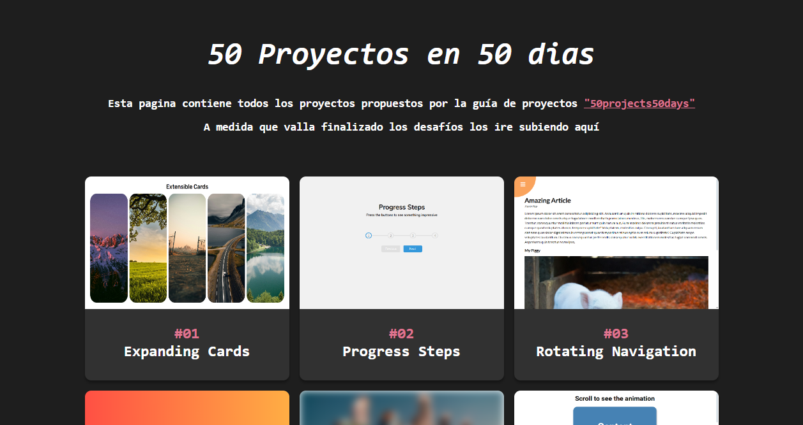

# 50Projects50Days



Esta es mi versión del desafío de 50 proyectos en 50 días ***HTML - CSS - JAVASCRIPT*** 
  
[👁️- Ver Demo](https://marianomigueles.github.io/50Proyects50Days/)

## Descripción - 💻
Estoy realizando este proyecto, a modo de práctica, propuesto por [50projects50days](https://github.com/bradtraversy/50projects50days), para mejorar mis conocimientos en HTML, CSS y JavaScript.  
A medida que vaya terminando cada proyecto, iré agregándolos a este repositorio.  
Finalmente, diseñaré una interfaz para poder visualizar cada proyecto de una manera más cómoda y sencilla.  

Mis objetivos:

1. Diseñar mi propia interfaz para visualizar los mini proyectos a medida que son agregados.
2. Adjuntar todos los proyectos.
3. Intentar mejorar la versión original de cada proyecto.
4. Solo valerme de la ayuda visual de la demo de cada proyecto, sin depender del código.
5. Recopilar todo lo aprendido con este desafío.
##
### ¿Qué he aprendido hasta ahora? - 💡

1- Inserción de imágenes en las etiquetas style de HTML
  ```html
  <div  
  	class="card active"  
  	style="background-image: url('https://unsplash.com/photos/j_gnGCDQRew/download?ixid=M3wxMjA3fDB8MXxhbGx8fHx8fHx8fHwxNzE1Mjc4OTk0fA&force=true')">
  </div>
  ```    

2- El origen de donde comienza la transformación
  ```css
  transform-origin: top left;
  ```   

3- Separar una palabra por letras de una manera más sencilla
  ```js
  .split('')
  .map((letter, idx) => `<span style="transition-delay:${idx * 50}ms">${letter}</span>`)
  .join('')
  ```

4- Mejorar mi entendimiento sobre las animaciones 
  ```css
  transition: transform 0.5s linear;
  transition: transform 0.3s cubic-bezier(0.68, -0.55, 0.265, 1.55);
  ```

5- Uso de pseudo-clases que seleccionan solo los elementos con números pares
 ```js
  .scroll-card:nth-of-type(even) {
    transform: translateX(400%);
  }
  ```
  
# Author - 💪​

- Linkedin - [in/mariano-joel-migueles](https://www.linkedin.com/in/mariano-joel-migueles/)

#
### Menciones
Algunas de las ideas visuales fueron sacadas de [Gabriel-Teresczuk](https://github.com/gabrielteresczuk/50Proyects50Days/tree/master). Gracias 💪
